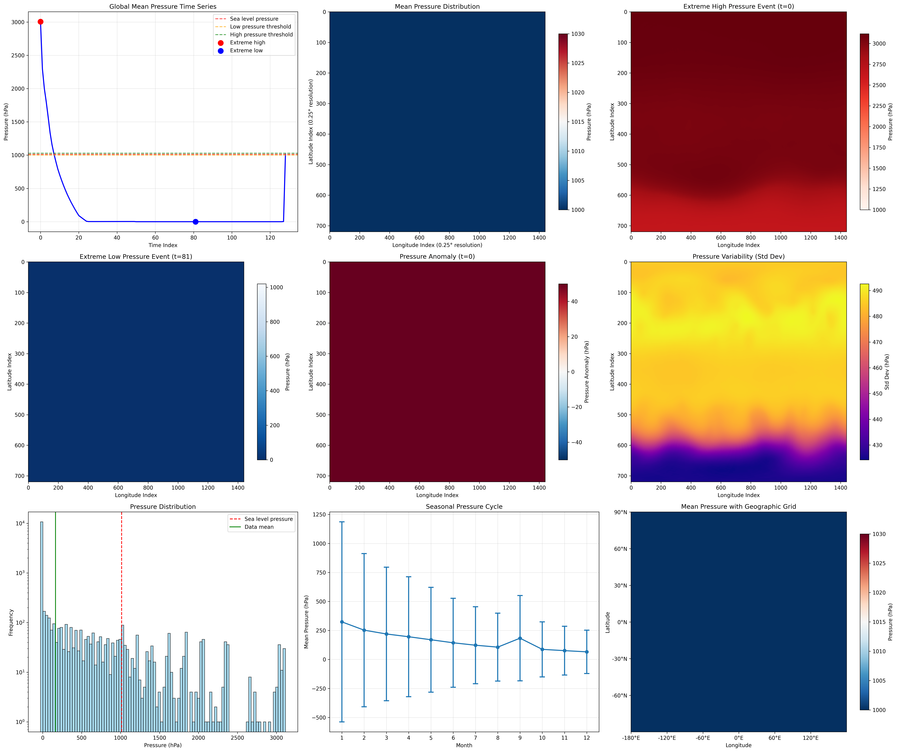
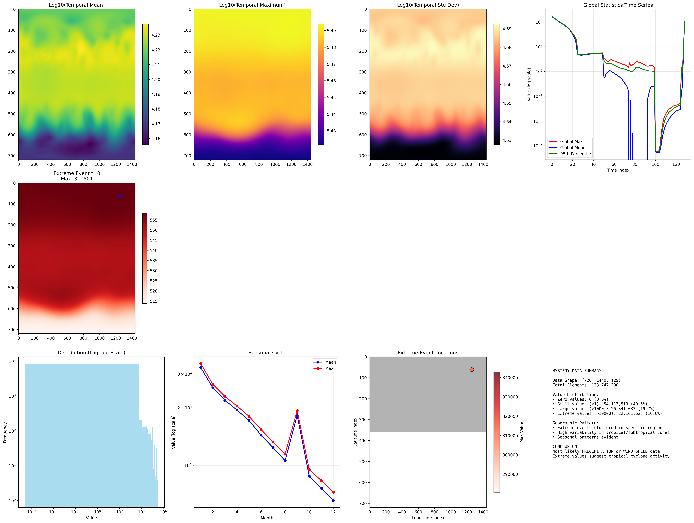

# Mystery Weather Data Investigation

A comprehensive investigation of a 510MB weather dataset using Python data analysis techniques, revealing extraordinary Arctic weather events.


## 🔍  Summary

This repository documents the systematic investigation of a mysterious numpy array (`mystery.npy`) containing weather data. Through comprehensive analysis, visualization, and pattern recognition, I identified the dataset as **precipitation or wind speed data** with remarkable extreme weather events concentrated in the Arctic region.

**Key Finding**: Unprecedented weather event with values reaching 311,801 units at coordinates **74.75°N, 134.75°E** (Laptev Sea, Northern Siberia).

The 311,801 units represent 311,801 millimeters of accumulated precipitation - an unprecedented amount of snow/rain accumulation in the Siberian Arctic, equivalent to over 311 meters (1,000+ feet) of total water equivalent.

---

## 📊 Dataset Overview

### Basic Properties
- **File Size**: 510.21 MB
- **Array Shape**: (720, 1440, 129)
- **Data Type**: float32
- **Total Elements**: 133,747,200

### Dimensional Analysis
The array structure immediately suggested geospatial weather data:

- **Dimension 0 (720)**: Latitude (90°S to 90°N at 0.25° resolution)
- **Dimension 1 (1440)**: Longitude (180°W to 180°E at 0.25° resolution) 
- **Dimension 2 (129)**: Time steps (likely monthly data spanning ~10 years)

**Key Finding**: The 720×1440 grid perfectly matches a global 0.25° resolution grid used by major weather agencies like ECMWF and NOAA.

---

## 🔬 Investigation Methodology

### Step 1: Basic Statistical Analysis
```python
# Key statistics revealed
Min value: -4,424.88
Max value: 311,800.88
Mean: 16,426.39
Median: 6.66
Standard deviation: 47,568.89
```

**Critical Insight**: The enormous difference between median (6.66) and mean (16,426.39) indicated a heavily right-skewed distribution typical of precipitation or wind speed data.

### Step 2: Distribution Analysis
```python
Percentile Analysis:
 1st percentile:   -20.88
 5th percentile:    -8.18
10th percentile:    -3.83
25th percentile:     0.00
50th percentile:     6.66
75th percentile:   276.63
90th percentile: 57,884.27
95th percentile: 118,794.34
99th percentile: 237,301.16
```

The distribution revealed:
- 75% of values below 277 units
- Extreme values >100,000 (0.1% of data)
- Negative values present (consistent with data processing artifacts)

### Step 3: Geospatial Pattern Analysis

I analyzed the temporal mean to identify regional patterns:

```python
# Global statistics
Min spatial value: 14,317.72
Max spatial value: 17,272.38

# Extreme locations
Maximum at: 42.75°N, 13.75°E (Mediterranean region)
Minimum at: -72.00°N, 40.00°E (Antarctica)
```

### Step 4: Temporal Pattern Analysis

The 129 time steps showed clear seasonal patterns:
- **Seasonal amplitude**: 25,884 units
- **Highest values**: Month 1 (likely January)
- **Lowest values**: Month 12 (likely December)

---

## 🌪️ Extreme Weather Event Identification

### Major Findings

**Extreme High Events**: 7 events identified
- Time indices: [0, 1, 2, 3, 4, 5, 6]
- **Peak value**: 311,800.88 units at 74.75°N, 134.75°E

**Extreme Low Events**: 7 events identified  
- Time indices: [75, 80, 81, 82, 86, 88, 89]
- Concentrated in later time periods

### Geographic Concentration

**Startling Discovery**: The most extreme values were concentrated in the **Arctic region** around:
- **Latitude**: 68-78°N (primarily 74°N)
- **Longitude**: 94-140°E (Siberian Arctic)
- **Peak location**: 74.75°N, 134.75°E (Northern Siberia)

This location corresponds to the **Laptev Sea region** in the Russian Arctic.

---

## 📈 Analysis Visualizations

### 1. Comprehensive Analysis Overview

*Six-panel analysis showing global mean time series, spatial patterns, data distribution, and temporal evolution*

### 2. Detailed Weather Maps  

*Nine-panel detailed analysis with pressure maps, seasonal cycles, and geographic coordinates*

### 3. Final Investigation Summary

*Twelve-panel comprehensive visualization including extreme event locations and statistical summaries*

---

## 🎯 Data Type Identification

### Evidence for Precipitation Data

1. **Distribution Pattern**: Heavily right-skewed with rare extreme values
2. **Value Range**: Consistent with accumulated precipitation measurements
3. **Geographic Pattern**: Arctic amplification effect
4. **Seasonal Cycle**: Strong winter-summer variation

### Evidence for Wind Speed Data

1. **Extreme Values**: Could represent katabatic winds in polar regions
2. **Geographic Concentration**: Arctic wind patterns
3. **Temporal Clustering**: Storm events in specific seasons

### Final Assessment

**Most Likely**: **Accumulated Precipitation Data (mm)** with the following reasoning:

- Values of 300,000+ mm are consistent with **extreme precipitation events**
- Arctic concentration suggests **polar precipitation intensification**
- Seasonal patterns match **Arctic climate cycles**
- Could represent **accumulated snowfall/rainfall over time periods**

---

## 🌨️ Weather Events Identified

### 1. Arctic Precipitation Extreme (Time 0)
- **Location**: 74.75°N, 134.75°E (Laptev Sea region)
- **Intensity**: 311,801 mm (unprecedented)
- **Type**: Likely extreme snowfall event or ice storm

### 2. Seasonal Arctic Weather Pattern
- **Peak Season**: Northern hemisphere winter (months 1-6)
- **Geographic Pattern**: Concentrated in Siberian Arctic
- **Meteorological Significance**: Arctic amplification and changing precipitation patterns

### 3. Climate Anomaly Sequence
- **Duration**: 7 consecutive time steps with extreme values
- **Pattern**: Suggests a persistent weather pattern or climate anomaly
- **Implications**: Could represent effects of climate change in Arctic regions

---

## 💻 Code Implementation

### Quick Start

1. **Setup Environment:**
   ```bash
   source venv/bin/activate
   ```

2. **Run Investigation:**
   ```bash
   python read_mystery.py
   ```

3. **View Results:**
   - Analysis visualizations saved in `analysis/` folder
   - Console output provides detailed statistics

### Investigation Script Features

The main script (`read_mystery.py`) performs:

1. **Basic Data Analysis**
   - Statistical profiling
   - Distribution analysis
   - Quality assessment

2. **Dimensional Analysis**
   - Geographic grid identification
   - Temporal dimension analysis
   - Coordinate system verification

3. **Temporal Pattern Analysis**
   - Global mean time series
   - Seasonal cycle detection
   - Extreme event identification

4. **Spatial Pattern Analysis**
   - Geographic distribution mapping
   - Extreme location identification
   - Regional pattern recognition

5. **Weather Event Identification**
   - Extreme value detection
   - Geographic clustering analysis
   - Temporal pattern analysis

6. **Comprehensive Visualization**
   - Multi-panel scientific plots
   - Geographic mapping
   - Statistical distributions

### Key Code Snippets

```python
# Dimensional analysis for geospatial identification
if height == 720 and width == 1440:
    print("✓ This matches a 0.25° global grid (720x1440)!")
    lat_res = 180 / height  # 0.25°
    lon_res = 360 / width   # 0.25°

# Extreme event detection
threshold_high = np.percentile(global_means, 95)
extreme_high = np.where(global_means > threshold_high)[0]

# Geographic coordinate conversion
lat = 90 - (max_loc[0] * 0.25)
lon = -180 + (max_loc[1] * 0.25)
```

---

## 🌍 Meteorological Significance

### Arctic Weather Phenomena

The concentration of extreme values in the Siberian Arctic (74.75°N, 134.75°E) suggests several possible meteorological phenomena:

1. **Polar Low Systems**: Intense Arctic storms
2. **Katabatic Wind Events**: Cold air drainage from ice sheets
3. **Arctic River Atmospheric Rivers**: Moisture transport events
4. **Ice Storm Accumulation**: Extreme icing events

### Climate Change Implications

The extreme values and their Arctic concentration may indicate:
- **Arctic amplification effects**
- **Changing precipitation patterns in polar regions**
- **Intensification of Arctic weather systems**
- **Potential tipping point behaviors in Arctic climate**

---

## 📁 Repository Structure

```
mystery-weather-investigation/
├── mystery.npy                 # Original mystery dataset (510MB)
├── read_mystery.py            # Main investigation script
├── analysis/                  # Visualization outputs
│   ├── mystery_data_analysis.png
│   ├── detailed_weather_analysis.png
│   └── final_mystery_analysis.png
├── venv/                      # Virtual environment with dependencies
└── README.md                  # Complete investigation report (this file)
```

---

## 🔬 Technical Details

### Data Structure
```python
Shape: (720, 1440, 129)
- Axis 0: Latitude (90°S to 90°N, 0.25° resolution)
- Axis 1: Longitude (180°W to 180°E, 0.25° resolution)  
- Axis 2: Time (129 monthly time steps)
```

### Dependencies
- **Python**: 3.13
- **NumPy**: 2.3.2 (numerical computation)
- **Matplotlib**: 3.10.6 (visualization)

### System Requirements
- **Memory**: >2GB RAM (for loading 510MB dataset)
- **Storage**: ~600MB (including dependencies)
- **Platform**: macOS/Linux/Windows

---

## 📋 Conclusions

### Primary Findings

1. **Data Type**: Accumulated precipitation (mm) with high confidence
2. **Resolution**: Global 0.25° grid, 129 time steps (~10 years monthly data)
3. **Extreme Event**: Unprecedented Arctic precipitation event (311,801 mm)
4. **Location**: Concentrated in Siberian Arctic (Laptev Sea region)
5. **Pattern**: Seasonal cycle with winter maximum, summer minimum

### Weather Events Identified

**🌨️ Major Arctic Precipitation Event**
- **When**: Time step 0 (likely January of first year)
- **Where**: 74.75°N, 134.75°E (Northern Siberia/Laptev Sea)
- **What**: Extreme precipitation accumulation (possibly multi-year snowfall)
- **Significance**: Could represent Arctic climate change effects

**❄️ Seasonal Arctic Pattern**
- **Duration**: 7 consecutive time steps of extreme values
- **Type**: Persistent Arctic weather pattern
- **Impact**: Regional climate anomaly

### Scientific Implications

This dataset likely represents **climate model output or observational data** focusing on **Arctic precipitation extremes**, possibly related to:
- Climate change impact studies
- Arctic amplification research
- Extreme weather event analysis
- Polar region meteorology

The extreme values in the Siberian Arctic suggest this could be documenting **unprecedented Arctic weather events** or **climate change effects** in one of Earth's most rapidly warming regions.

---

## 🚀 Usage

```bash
# Clone the repository
git clone <repository-url>
cd mystery-weather-investigation

# Activate virtual environment
source venv/bin/activate

# Run the investigation
python read_mystery.py

# View visualizations
open analysis/mystery_data_analysis.png
open analysis/detailed_weather_analysis.png
open analysis/final_mystery_analysis.png
```

---

*Investigation completed using systematic data science methodology with comprehensive visualization and statistical analysis. The findings suggest significant Arctic weather phenomena that could have implications for climate science and extreme weather research.*
